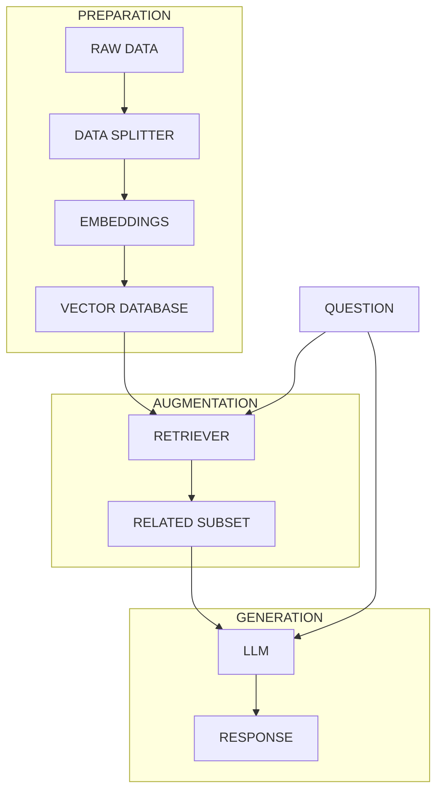

```mermaid
flowchart TB
    subgraph PREPARATION ["PREPARATION"]
        direction TB
        A[RAW DATA] --> B[DATA SPLITTER]
        B --> C[EMBEDDINGS]
        C --> D[VECTOR DATABASE]
    end
    E[QUESTION]
    subgraph AUGMENTATION
        D --> F[RETRIEVER]
        F --> G[RELATED SUBSET]
    end
    E --> F
    E --> H
    subgraph GENERATION
        H[LLM]
        G --> H
        H --> RESPONSE
    end
```